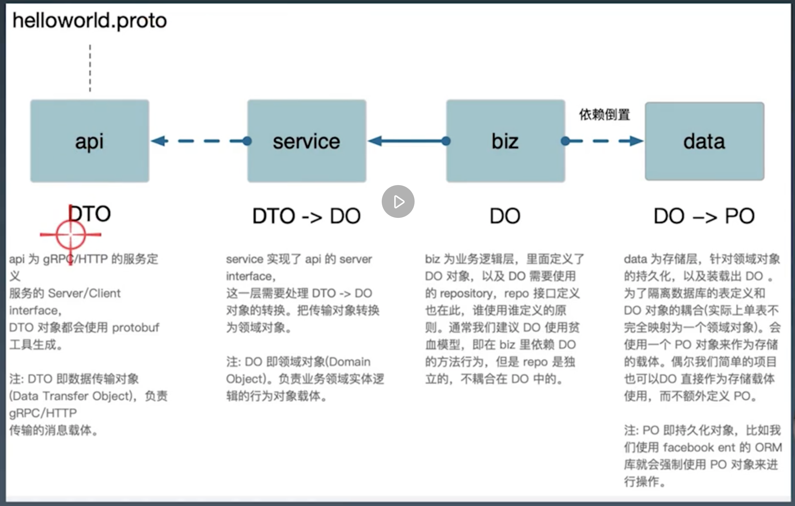

# Week 4 go的工程化实践

# 1.1 Standard go project layout
* `/cmd`
多人参与时，需要一个toolkit来方便生成项目模板，尽可能方便大家统一的工程目录布局。
```go
/cmd //主干
/cmd/myapp //应用程序目录应该与想要的可执行文件名称相匹配。
//包含 二进制文件 以及 main.go›
```
* `/internal`: 如果代码需要导入被别的项目使用，那么应该放在`/pkg` 目录中；如果不希望被重用，则应该放在`/internal`中。(go compiler 完成这个约定，导入package时不会导入其internal目录)；

* `/pkg` 外部应用程序可以使用的库代码；
    - `/internal` 
    - `/internal/pkg` 项目内的 跨多可应用的公共共享代码；作用域：单个项目
    - Travis Jeffery: [I'll take pkg over internal](https://travisjeffery.com/b/2019/11/i-ll-take-pkg-over-internal/)

# 1.2 Kit Project layout 基础库/框架
参考slides里的结构图

# Service Application Project layout
* /api  protobuf文件预定义api
* /configs 配置文件
* /test 外部测试应用和测试数据
* 不鼓励/不应该有/src 目录；gopath/src，现在用go mod已经不需要src目录了。

## 微服务中的app服务类型
* interface  对外的BFF服务；比如暴露HTTP/gRPC接口
* service  对内的微服务；比如只暴露gRPC接口
* admin 面向devops
* job 流式处理
* task 定时任务；k8s cronjob来编排管理


* api: DTO generated by protobuf
* service: DTO -> DO  (现阶段需要手写，以后kratos可能会提供tools)
* biz: 业务逻辑层, 定义了DO；不是单纯getter setter；DO包含一些方法，比如用户是否封禁呀
* data: 存储层; DO->PO; 隔离数据库的表定义和DO对象的耦合。

Kratos把Domain Driver Design融合到工程框架中去了。

## Lifecylce
lifecylce:服务应用对象的初始化以及生命周期的管理；所有http/grpc依赖前置资源的初始化，包括data biz service； 之后再启动监听服务。

Kratos 使用google的wire来管理所有资源的依赖注入。
* 依赖注入举例；自己启动redis vs 传入redis
    - 方便测试
    - 单词初始化 和 复用
* Kratos 源码 app.go (使用参考app_test.go)
    - New()
        - options: 可以定义服务的name version metadata endpoint 
            - 注册信号
            - server 需要管理的server比如http grpc
    - Run()
        - error group 管理server；**外部**context控制所有server推出
        - signal也在errgroup被监听
    - Stop()
        - 注销请求
        - cancel
    ```go
    func TestApp(t *testing.T) {
	hs := http.NewServer()
	gs := grpc.NewServer()
	app := New(
		Name("kratos"),
		Version("v1.0.0"),
		Server(hs, gs),
	)
	time.AfterFunc(time.Second, func() {
		app.Stop()
	})
	if err := app.Run(); err != nil {
		t.Fatal(err)
	}
    }
    ```

---
# 2. API 设计
## GRPC
## API project layout
* 项目中的proto，以api为包名根目录。
* 建立同步映射，在统一仓库中管理的proto，以仓库名为包名根目录
## API compatibility
* 向后兼容的修改
    - 添加api接口
    - 给请求加字段
    - 给响应消息加字段
* 向后不兼容的修改
    - 删除/重命名服务，字段，方法或enum
    - 修改字段类型
    - 修改现有请求的可见行为
    - 给资源消息添加 read/write 字段
## API naming conventions
* 参考google calendar api为例子，标准化命名 - request uri 
```
// request uri:
// <package_name>.<version>.<service_name>/{method}
package <package_name>.<version>
```

## API primitive fields
* grpc默认protobuf v3；去除了required optional 关键字；默认全部都是optional字段，没有复制的字段会默认基础字段默认值，比如0或者“”。
* 建议使用wrapper类型，包装message，使用时边指针，从而可以判断赋值与否。

总结：protobuf是强schema描述文件。

##  API ERRORs
* best practice：
    - 不需要被详细处理的，通通返回标准错误
    - 需要被详细处理的，带上root cause，operation,etc
* 错误传播
    - 不应该把dependency的错误传播到客户端
        - 隐藏实现和机密信息
        - 调整负责该错误的一方，比如，从dependency接受到的invalid_argument 错误，服务器应该将internal传播给自己的调用者。
    - 全局错误码：
        - 每个服务传播错误时，应该做一次翻译，保证每个服务+错误枚举 应该是唯一的。在proto定义中是可以写出来的。 
        - bff感兴趣的会被翻译出来，其他的通通500
        - 错误码的唯一性是跟服务绑定的。


### Kratos的errors实现

```golang
// New returns an error object for the code, message.
func New(code int, reason, message string) *Error {
	return &Error{
		Code:    int32(code), //大类错误http/grpc状态码
		Message: message, //和code一一对应
		Reason:  reason, //小类错误
	}
}
```
kratos errors定义后，最终还是需要通过http或者grpc传递，还需要映射成http状态码，grpc状态码：
```golang
// DefaultErrorEncoder encodes the error to the HTTP response.
func DefaultErrorEncoder(w http.ResponseWriter, r *http.Request, err error) {
	se := errors.FromError(err)
	codec, _ := CodecForRequest(r, "Accept")
	body, err := codec.Marshal(se)
	if err != nil {
		w.WriteHeader(http.StatusInternalServerError)
		return
	}
	w.Header().Set("Content-Type", httputil.ContentType(codec.Name()))
	w.WriteHeader(int(se.Code))
	w.Write(body)
}
```

## API design 
问题：GRPC结构体被很多复用，某些字段a用，某些b用，会给api的调用者/实现者带来一些歧义。
grpc solution： fieldMask部分更新
    * 用field mask可以标识出那些字段被更新了


## **毛老师强推阅读 google api design**

## References：
1. [Introduction to gRPC](https://grpc.io/docs/what-is-grpc/introduction/)
    * On the server side, the server implements this interface and runs a gRPC server to handle client calls.
    * On the client side, the client has a stub (referred to as just a client in some languages) that provides the same methods as the server.
    * Protocol Buffers:
        - mechanism for serializing structured data (others such as json)
        -  first define structure for the data in a .proto file.
        ```golang
        message Person {
            string name = 1;
            int32 id = 2;
            bool has_ponycopter = 3;
        }
        ```
        - use protocol buffer compiler `protoc` to generate data access clasess in your preferred languages.
        - define services; four kinds of service method
            - Unary RPCs where the client sends a single request to the server and gets a single response back, just like a normal function call.
            - Server streaming RPCs where the client sends a request to the server and gets a stream to read a sequence of messages back.
            - Client streaming RPCs where the client writes a sequence of messages and sends them to the server, again using a provided stream.
            -  Bidirectional streaming RPCs where both sides send a sequence of messages using a read-write stream. The two streams operate independently, so clients and servers can read and write in whatever order they like: 

2. [gRPC/go Basics tutorial](https://grpc.io/docs/languages/go/basics/)
3. A even more basic tutorial: [gRPC/go Quick Start](https://grpc.io/docs/languages/go/quickstart/#prerequisites)
    - how to run rpc server and client.
    - how to regenerate rpc code.

 
# 3. 配置管理
* 配置种类
    - 环境变量
    - 静态配置
        http.grpc server, redis, mysql
    - 动态配置
    - 全局配置：
        - 避免各个项目大量copy paste；
* example:  
    - 初期探索： 从配置文件出发解析得到redis client（几种方案）都有缺点
    - Dave Cheney 大神给的方案：**Functional options** for friendly APIs
    ```golang
    //或者直接把DialOption定义为函数指针 type DialOption func(*dialOptions)
    type DialOption struct {
        f func(*dialOptions) //注意dialOption是没办法在runtime被别人改的，只能通过拓展DialOption完成配置修改
    }

    func Dial(network, address string, options ...DialOption) (Conn, error) {
        do := dialOptions {
            dial: net.Dial
        }

        for _, option := range options {
            option.f(&do) // 覆盖该选项的字段
        }
    }
    ```

    ```golang

    package main
    import (
        "time"
        "github.com/go-kratos/kratos/pkg/cache/redis"
    )
    func main() {
        c, _ := redis.Dial("tcp", "127.0.0.1:3389", 
            redis.DialDatabase(0), // 可选参数
            redis.DialPassword("hello"),
            redis.DialReadTimeout(10 * time.Second)
        )
    }
    ```
    - functional options: example 2, verbosity 修改及恢复。
    - functional options: example 3, grpc GreeterClient的例子，把option定义成interface，通过组合的方法达到添加option字段

* krator 实践
    - yaml + protobuf
        - yaml to json => protobuf => load as `c *Config` 再通过Options()方法转化成[]redis.Options 即可。
        ```golang
        func main() {
            // load config file from yaml.
            c := new(redis.Config)
            _ = ApplyYAML(c, loadConfig())
            r, _ := redis.Dial(c.Network, c.Address, Options(c)...)
        }
        ```

## Configuration Best Practice


# 4. 模块/单元测试

## Go Package 管理发展史
* 发展
    - GOPATH
    - Vendor, 解决gopath模式下多个工程需要共享GOPATH目录，无法使用与哥哥工程对于不同版本的依赖包的使用的问题。
    - Go Module go1.11后
* GOPATH环境变量
    - go get会将依赖下载到gopath的src下。
* go module
    - go.mod and go.sum 主要包括依赖路径和checksum保证包的安全性；不再依赖gopath
    - module
    - go 版本
    - require
    - exclude：排除特定版本
    - 替换require中的依赖

* go proxy: 介绍了好多绕过公网下载pkg的知识哈哈哈

## 测试
* Unit Test
    - go test
    - yapi
* docker
    - test目录下有一个docker-compose.yaml会描述我们依赖的资源
    - 有数据库的资源，比如测试数据